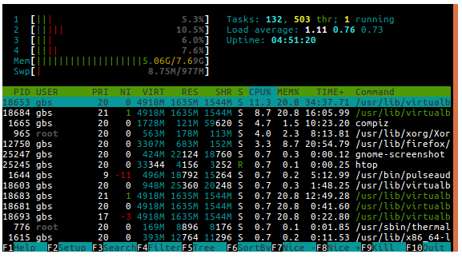

# Organização do RootFS

A organização do RootFS no Linux, em termos de diretórios, é padronizada pelo [_FileSystem Hierarchy Standard_](https://wiki.linuxfoundation.org/lsb/fhs). 

A maioria dos sistemas Linux corroboram com esse padrão e também estão organizados desta forma. As aplicações, em geral, esperam esse tipo de organização do sistema. Isso facilita o trabalho de usuários e desenvolvedores. Uma vez quea estrutura organizacional do RootFS é parecida em diferentes distribuições Linux.

### Diretórios mais Importantes

Os principais diretórios do sistemas são:

* `/bin` - Programas básicos;
* `/sbin` - Programas para administração do sistema;
* `/boot` - Imagens de boot \(bootloader, kernel, initramfs e etc.\);
* `/home` - Home do usuário root;
* `/lib` - Bibliotecas básicas do sistema;
* `/media` - Ponto de montagem para mídias removíveis;
* `/mnt` - Ponto de montagem para mídias estáticas;
* `/dev` - Arquivos de dispositivos;
* `/sys` - Ponto de montagem do sistema de arquivos virtual sysfs;
* `/proc` - Ponto de montagem do sistema de arquivo virtual "proc";
* `/tmp` - Arquivos temporários;
* `/usr` - Aplicações e dados do usuário;
  * `/usr/bin` - Aplicações básicas do usuário;
  * `/usr/lib` - Bibliotecas do usuário;
  * `/usr/sbin` - Aplicações de administração do usuário;
* `/var` - Arquivos de dados variáveis \(logs, branco de dados e arquivos temporários\).

### Separação de Programas e Bibliotecas

Os programas, programas de sistemas e bibliotecas básicas são instalados nos diretórios, mencionados acima, `/bin`, `/sbin` e `/lib` respectivamente.

Os programas como `ls`, `ifconfig`, `cp`, `grep` e etc, utilizados durante o treinamento, estão disponíveis nos diretórios `/bin` e `/sbin` enquanto as bilbiotecas C por exemplo, estão no diretório `/lib`.

Todos os outros programas, aqueles que vem junto com a distribuição Linux instalada, como no caso do Ubuntu. Estão disponíveis em `/usb/bin`, `/usr/sbin` e `/usr/lib`.

### Arquivos de Dispositivos

Uma das regras mais importantes quando se trabalha com o kernel Linux é que as aplicações do usuário podem acessar dispositivos de hardware através de uma API comum \(as já mencionadas System Calls\).

Desta forma, todos os dispositivos de hardware são representados através de arquivos no sistemas. Chamamos estes de arquivos de dispositivos, e encontram-se no diretório `/dev`.

Internamente, o kernel Linux identifica cada dispositivo por meio de três informações básicas:

* **Major number**: que indica a categoria deste dispositivo
* **Minor number**: indica o número do dispositivo
* **Tipo**:
  * **Dispositivos de bloco**: Composto por blocos de dados de tamanho fixo, que podem ser lidos e escritos, endereçáveis e de acesso aleatório. Por exemplo, HD, pendrive, cartão SD;
  * **Dispositivos de caractere**: Permite acesso sequencial de bytes, sem começo, sem fim, sem tamanho fixo! Exemplo clássico: a porta serial. Além disso, placas de som, rede, câmeras.

A grande maioria dos dispositivos que não são de blocos, são representados como dispositivos de caractere no kernel Linux.

### Exemplos de Arquivos de Dispositivos

Podemos listas os arquivos de dispositivos dentro do diretório `\dev`.

```text
ls -la /dev/ttyS* /dev/sda1
```

```text
brw-rw---- 1 root disk    8,  1 Jan  8 10:39 /dev/sda1
crw-rw---- 1 root dialout 4, 64 Jan  8 10:39 /dev/ttyS0
crw-rw---- 1 root dialout 4, 65 Jan  8 10:39 /dev/ttyS1
crw-rw---- 1 root dialout 4, 74 Jan  8 10:39 /dev/ttyS10
crw-rw---- 1 root dialout 4, 75 Jan  8 10:39 /dev/ttyS11
crw-rw---- 1 root dialout 4, 76 Jan  8 10:39 /dev/ttyS12
crw-rw---- 1 root dialout 4, 77 Jan  8 10:39 /dev/ttyS13
```

* _Campo 1_: é o tipo \(b: dispositivo de bloco, c: dispositivo de caracter etc\). 
* _Campo 2-4_:  permissões de dono, grupo e todos os usuários;
* _Campo 5_: número de links ou diretórios dentro deste diretório/arquivos.
* _Campo 6_: usuário dono deste arquivo;
* _Campo 7_: grupo que o arquivo pertence;
* _Campo 8_: tamanho em bytes.

Para escrever em um arquivo de dispositivo, como por exemplo, uma porta serial:

```c
int fd;
fd = open("/dev/ttyS0", O_RDWR);
write(fd, "Hello", 5);
close(fd);
```

Inicializamos um _file descriptor_ e utilizamos as funções `open`, `write` e `close` para a sua manipulação. Lembre-se essas funções são proporcionadas pela API comum da biblioteca padrão C.

### ProcFS

O sistema de arquivo virtual, mencionado na seção de características do kernel Linux, é chamado de **procfs**. Ele existe desde o inívio do desenvolvimento do Linux. 

O **procfs** permite o kernel exportar estatísticas dos processos em execução do sistema, através do diretório `/proc`. Além disso, permite que o usuário altere parâmetros do kernel em tempo de execução. Algumas aplicações como `ps`, `top` e `htop` utilizam justamente o `/proc` para extrair e exibir as informações sobre os processos em execução.



Para realizar a montagem do **procfs**:

```bash
mount -t proc nodev /proc
```

E para consutar mais informações é sempre possível utilizar o comando `man proc`.

### SysFS

O sitema de arquivo virtual sysfs, diferentemente do **procfs**, exporta informações de drivers e dispositivos de hardware conectados ao sistema. Este, permite somente representar em espaço de usuário a "visão" do kernel sobre barramento, dispositivos e drivers.

Este sistema é muito útil para aplicações que desejam listar informações de hardware. Além disos, as aplicações esperam que o **sysfs** seja monado em `/sys`.

```bash
ls /sys
```

```bash
block  class  devices   fs          kernel  power
bus    dev    firmware  hypervisor  module
```


